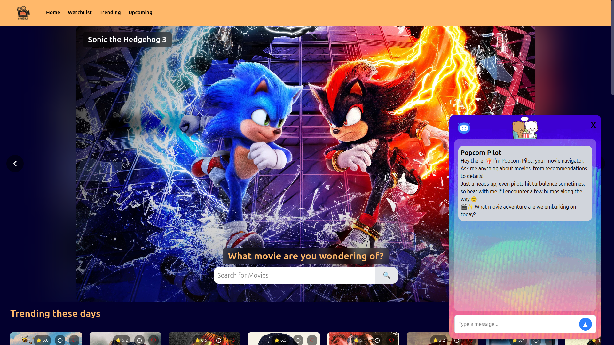
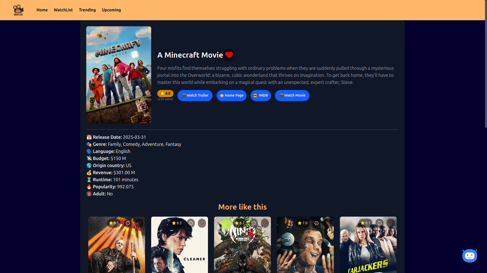
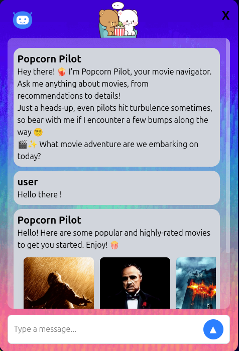

# Movie Hub 404 🎬🍿

A web application for movie enthusiasts to explore, discover, and get AI-powered recommendations for movies.


_Main Page Screenshot_

## Live Demo

👉 [https://movie-hub404.vercel.app/](https://movie-hub404.vercel.app/)

## Features ✨

- **Movie Exploration**: Browse various types of movies
- **AI Recommendations**: "Popcorn Pilot" chatbot suggests movies based on your prompt
- **Authentication System**: Save your watchlist to the cloud by signup and your data stays safe and portable.
- **Watchlist Management**: Save movies to your watchlist
- **Detailed Information**: View trailers, ratings, and other movie details
- **Free Streaming Links**: Find where to watch movies
- **Search Functionality**: Easily find specific movies

## Tech Stack 💻

- **Frontend**: React.js (Vite)
- **Component Architecture**: Modular and reusable components
- **Database**: Supabase
- **APIs**:
  - TMDB API (The Movie Database) for movie data
  - Gemini API for AI chatbot functionality

## Demo Video 🎥

[](https://youtu.be/yfRJAPOVJPY?si=CsGf5JSeSJ6Ps_Ta)

## Screenshots 📸

### Info Screen



### Popcorn Pilot (AI Chatbot)



## Setup Instructions 🛠️

1. Clone the repository:
   ```bash
   git clone https://github.com/Ritesh381/Movie-Hub.git
   ```

2. Install dependencies:
    ```bash
    npm install
    ```

3. Create a .env file and add your API keys:
    ```
    VITE_TMDB_API_KEY=your_tmdb_api_key
    VITE_GEMINI_API_KEY=your_gemini_api_key
    ```

4. Run the development server:
    ```bash
    npm run dev 
    ```

# Contribution 🤝
Contributions are welcome! Please open an issue or submit a pull request for any improvements.

